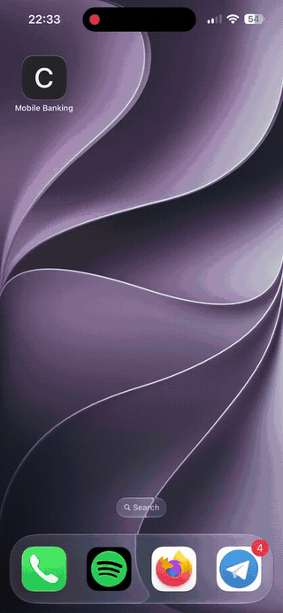
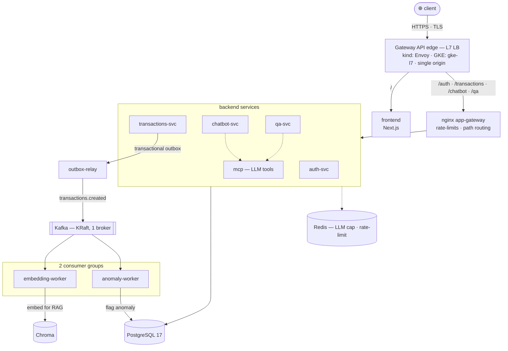
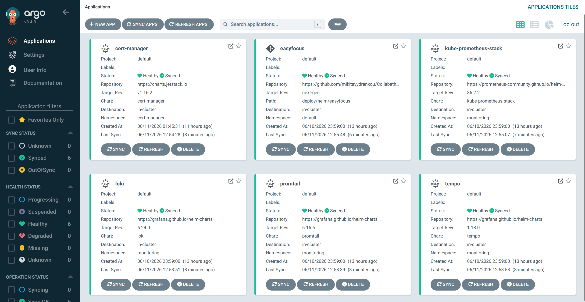
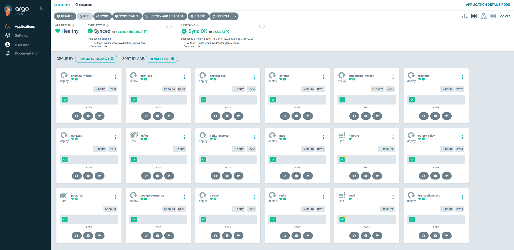
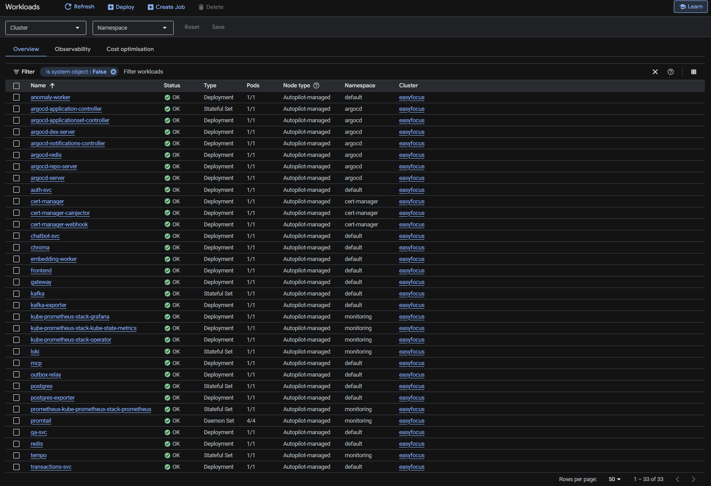
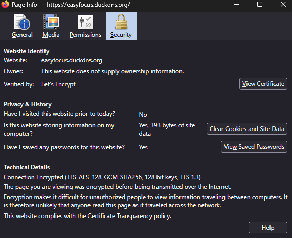
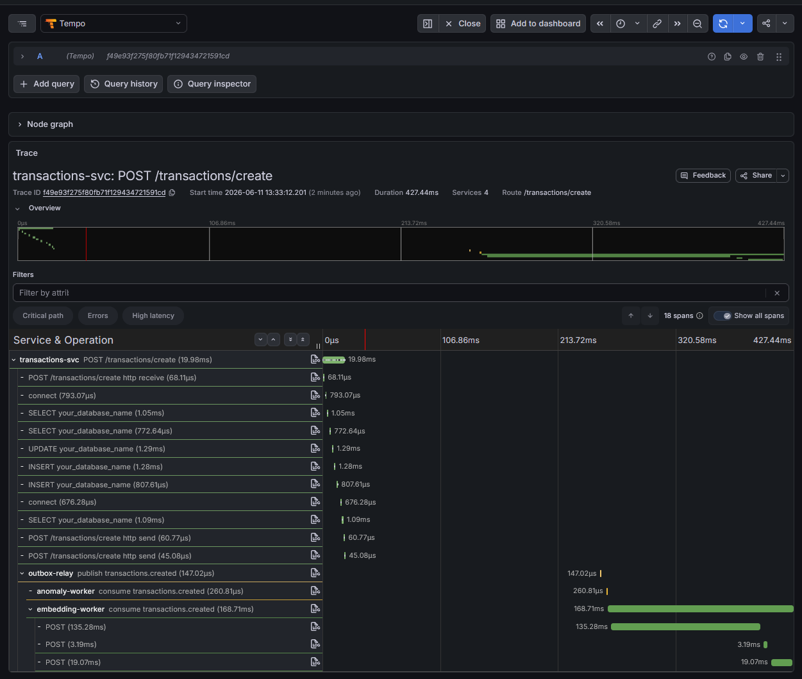
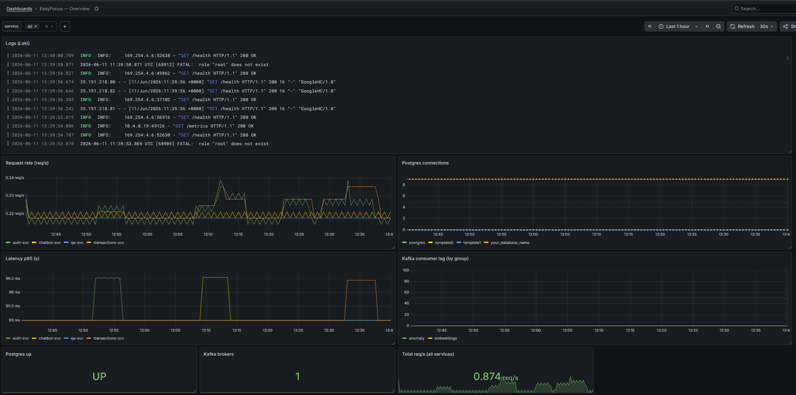
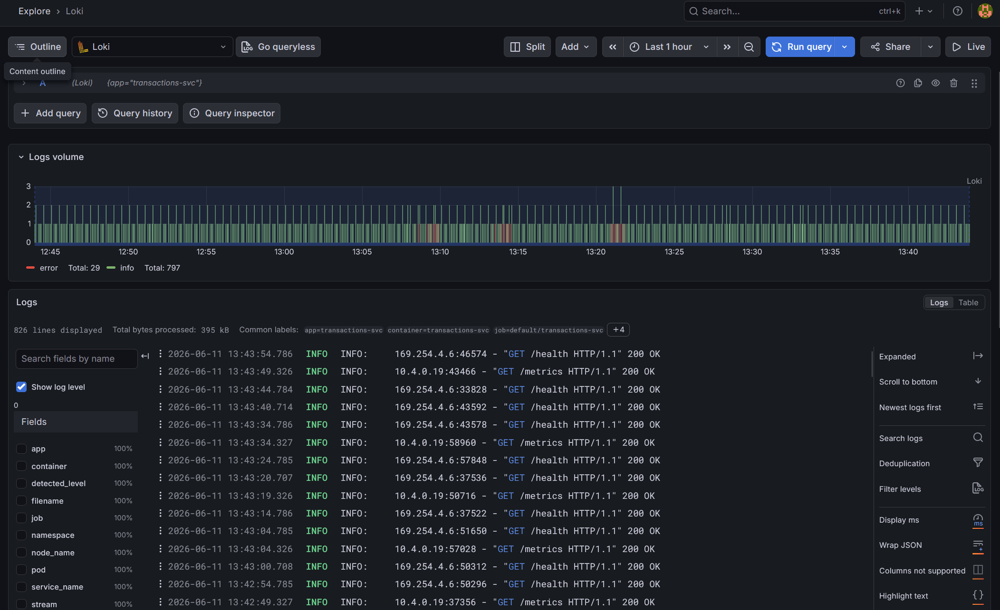

<div align="center">

# EasyFocus Assistant

### AI banking companion for everyone who needs a helping hand

Adaptive, conversational banking for neurodivergent and cognitively diverse users —
chat your way through payments, get step-by-step guidance, catch mistakes before they happen.

[](https://github.com/mikitavydrankou/Collabathon2025/actions/workflows/build-images.yml)
[](https://github.com/mikitavydrankou/Collabathon2025/commits/next-gen)


<sub>Team Beszketnyky · Collabathon 2025 for Commerzbank</sub>

</div>

---

## Demo

> The hosted demo has been retired to keep cloud costs down — here's a short walkthrough of the running app. ([project showcase →](https://easyfocus.duckdns.org))

<p align="center">
  
</p>

A familiar mobile-banking app, **rebuilt around accessibility** — an AI assistant on the surface, a real microservices platform underneath. Banking apps overwhelm people who think differently, so EasyFocus **remembers, watches, explains and adapts**, for you. In the clip:

- **Payment reminder** — never miss a bill, no deadlines to keep in your head.
- **Live system health** — every microservice up and running (a peek under the hood).
- **Recurring payment spotted** — paid right there through the AI chat.
- **"Need help?" → AI chat** — ask anything in plain language, like your balance.
- **Accessibility settings** — adapts to how each person reads and focuses.

## Why

**~1 billion people (16% of the world)** live with a significant disability — many cognitive
or neurodevelopmental. Banking apps, with their dense forms and unforgiving flows, turn routine
money tasks into a source of anxiety. EasyFocus meets people where they are, with **as much or
as little help as they want.**

## Features

- **Payment assistant chat** — natural language ("send €50 to John"), clarifying questions, speech-to-text.
- **Step-by-step guidance** — the AI walks you through every action, with visual cues and photo-based invoice parsing.
- **Quality checks** — anomaly detection validates amounts, accounts and recipients, warning before costly mistakes.
- **Proactive help** — recurring-payment reminders, offline mode, biometric login, conversational search over your data.

---

## Architecture

The hackathon monolith was cut into **microservices** and built out into a production-style
platform: async messaging, Kubernetes with GitOps, full observability, and infrastructure as code.



- **Services** (own `pyproject.toml` + Dockerfile, share an installable `shared-lib/` via poetry path-dep):
  `auth-svc`, `transactions-svc`, `chatbot-svc`, `qa-svc`, `mcp` · workers: `embedding-worker`,
  `anomaly-worker`, `outbox-relay` · `frontend` (Next.js).
- **Async core**: `transactions.created` events flow through a **transactional outbox** → **Kafka**
  → two consumer groups (embed into Chroma for RAG; score for anomalies, flag in Postgres).
- **Edge**: Gateway API (HTTPRoute), single origin — one host serves UI + API, no CORS.

Full service map + config reference: **[docs/ARCHITECTURE.md](docs/ARCHITECTURE.md)**.

## Platform / DevOps

| Concern        | Tooling                                                                       |
| -------------- | ----------------------------------------------------------------------------- |
| Orchestration  | **Kubernetes** — one umbrella **Helm** chart (`deploy/helm/easyfocus`)        |
| GitOps         | **Argo CD** — cluster syncs straight from this repo, selfHeal + prune         |
| Messaging      | **Kafka** (KRaft, single broker) + kafka-ui + kafka-exporter                  |
| Observability  | **Prometheus + Grafana** (RED dashboard), **Loki** logs, **Tempo** + OTel traces, alerts → Telegram — opt-in on GKE (`WITH_MONITORING=1`) to stay inside the free-tier budget |
| CI/CD          | **GitHub Actions** — pytest gates the build, all images pushed as `:latest` + `:<sha>`, **Trivy** CVE scan, then CI pins the chart to the SHA and **Argo CD rolls the cluster to exactly that build** |
| Cloud / IaC    | **Terraform** → **GKE Autopilot**, Artifact Registry, VPC, WIF (keyless CI)   |
| Edge           | Gateway API — Envoy (kind) / managed L7 LB (GKE), TLS via cert-manager + Let's Encrypt |

**GitOps in action** — Argo CD manages the whole platform from this repo; the easyfocus app alone is 18 tracked workloads:

<table>
  <tr>
    <td width="50%"><br/><sub>Argo CD — every app Healthy + Synced</sub></td>
    <td width="50%"><br/><sub>easyfocus app — services, workers, jobs, all green</sub></td>
  </tr>
  <tr>
    <td width="50%"><br/><sub>Live on GKE Autopilot — 50+ workloads, all OK</sub></td>
    <td width="50%"><br/><sub>HTTPS end to end — Let's Encrypt via cert-manager, TLS 1.3</sub></td>
  </tr>
</table>

## Quick start

### Local (Docker Compose) — fastest look

```bash
git clone https://github.com/mikitavydrankou/Collabathon2025.git
cd Collabathon2025
cp .env.example .env        # set DB creds + OPENAI_API_KEY
docker compose up -d --build
```

Open **http://localhost:3000**.

### Kubernetes (kind) — the real stack, GitOps

```bash
# needs WSL with docker + kind + kubectl + helm
# create deploy/helm/easyfocus/values-local.yaml with your creds (see deploy/README.md)
bash deploy/gitops-up.sh    # kind + MetalLB + Envoy Gateway + Argo CD + apps, all idempotent
bash deploy/cluster.sh pf   # port-forward Grafana / Prometheus / Argo + print URLs/creds
```

### Cloud (GKE) — Terraform

```bash
cd infrastructure
cp terraform.tfvars.example terraform.tfvars   # set project_id
bash apply.sh                                   # GKE Autopilot + Artifact Registry + WIF + static IP
# then deploy with the GKE overlay + HTTPS — see infrastructure/README.md and deploy/gke/README.md
```

> [!TIP]
> Set `OPENAI_API_KEY` before building — the chatbot and QA agents need it for LLM calls and embeddings.

## Observability

The umbrella chart ships a custom Grafana dashboard (`easyfocus-overview`): RED metrics per service,
error ratio, Kafka consumer lag per group, Postgres connections, and a traffic overview — plus Loki
log correlation and Tempo distributed traces (context propagated through the Kafka outbox).

The trace below is one real money transfer crossing **four services**: the HTTP request hits
`transactions-svc` (SQL + transactional outbox), `outbox-relay` publishes `transactions.created`
to Kafka, and both consumer groups — `anomaly-worker` and `embedding-worker` — pick it up,
all stitched into a single trace via context propagation through Kafka message headers:



<table>
  <tr>
    <td width="50%"><br/><sub>Custom dashboard — request rate, p95 latency, Kafka lag, Postgres</sub></td>
    <td width="50%"><br/><sub>Loki — per-service log streams with level detection</sub></td>
  </tr>
</table>

## Stack

**Frontend** Next.js 16 · React 18 · Tailwind · shadcn/ui
**Backend** FastAPI · SQLAlchemy 2 · LangChain + OpenAI · ChromaDB RAG · JWT auth
**Data/Async** PostgreSQL 17 · Redis · Kafka (KRaft) · Chroma · transactional outbox
**Platform** Kubernetes · Helm · Argo CD · Gateway API · Prometheus/Grafana/Loki/Tempo · Terraform/GKE · GitHub Actions + Trivy

---

<div align="center"><sub>Built so banking works for everyone — clear, calm, mistake-proof.</sub></div>
